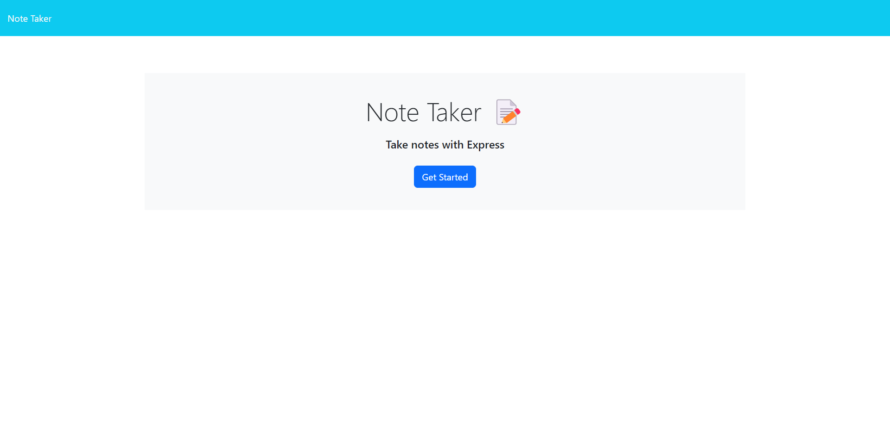
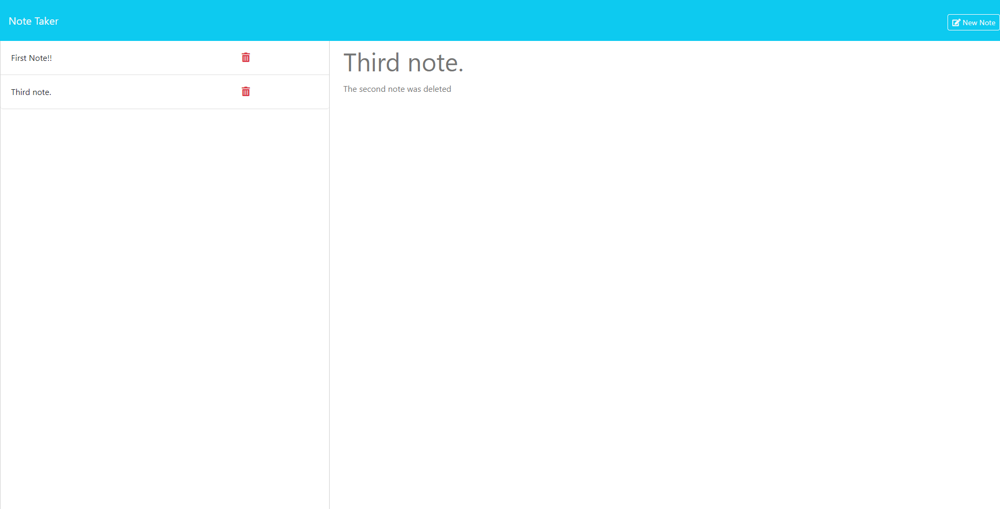

# README

## Description

This repository is made for the purpose of creating a note-taking app.  Notes are saved on the server the app is deployed from

## Visuals

## Usage

Click on get started to navigate to the notes page.  Type the title and text where indicated on the right, or select an existing note on the left.  While viewing an existing note, click the new note button to show the title and text prompts again.

## Technologies Used

HTML 5, CSS 3, Javascript ES6+, node.js, express

## Links

[Page Link](https://note-taker-app-4yfh.onrender.com)

[Repository link (Github)](https://github.com/jtschams/note-taker-app)

[Author Github Profile](https://github.com/jtschams)

## License

Please refer to LICENSE in repository

## Credits

express \
https://www.npmjs.com/package/express/ \
v4.16.4 \
